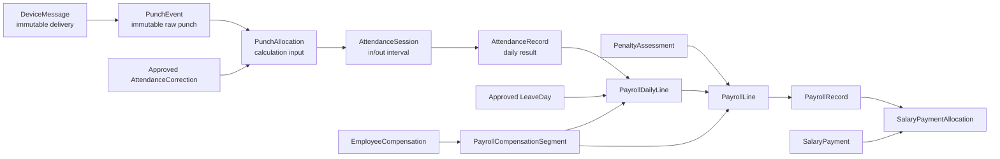
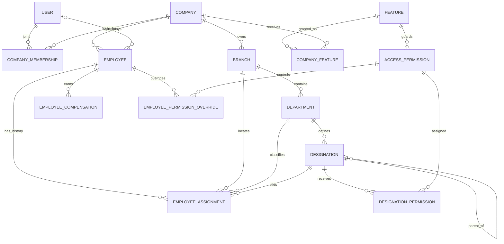
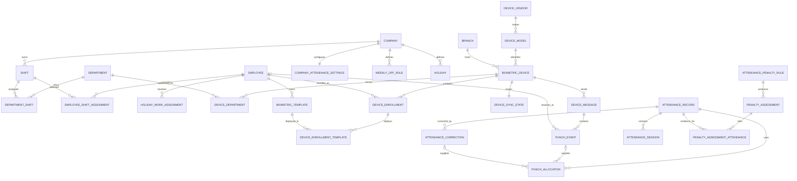
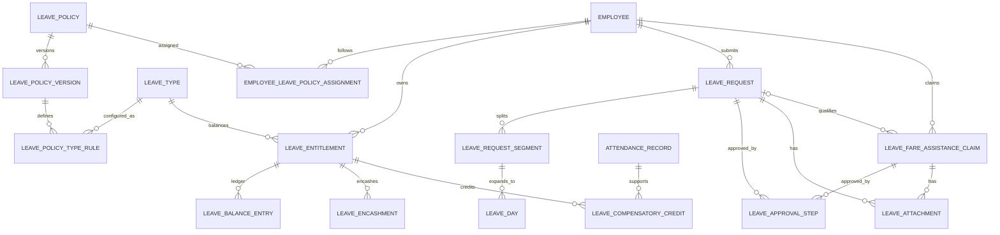
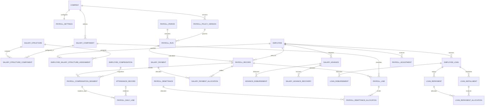
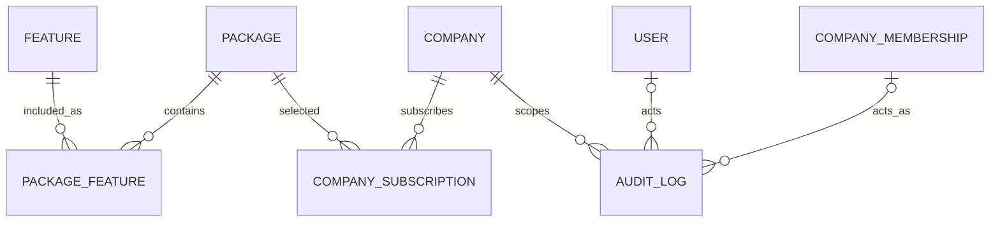

# Proposed PostgreSQL Database Schema

> Implemented schema correction (2026-09-07): Company.code remains varchar/string but is generated from a PostgreSQL sequence starting at 10001; slug is generated with name-based numeric suffixes. Existing identifiers remain unchanged. Company defaults are BDT, BD, Asia/Dhaka. CompanyMembership now has conditional uniqueness on company and user for non-ended owner/company_admin roles (one current master per company, not shared across companies). Historical ended memberships remain. CompanyAttendanceSettings.company is implemented as FK + UNIQUE (one-to-one cardinality). No new model/table/column was added by this correction; generated diagrams retain the same relationships. See UI_AND_ONBOARDING_CONVENTIONS.md for workflow rules.


> Documentation only for the separate attendance project. This is a relational schema proposal derived from `MODEL_FIELD_DICTIONARY.md`; it is not SQL, a migration, or executable Django code.

Read order:

1. [PROJECT_HANDOFF.md](PROJECT_HANDOFF.md) for requirements and decisions.
2. [DATABASE_MODEL_PLAN.md](DATABASE_MODEL_PLAN.md) for plain-language model purposes.
3. [MODEL_FIELD_DICTIONARY.md](MODEL_FIELD_DICTIONARY.md) for every proposed field, type, nullability, relationship, status, and constraint.
4. This document for the database-wide relationship map, ownership paths, physical-table implications, indexes, and processing flow.

For the **whole schema with every field inside every table**, open [the interactive diagram](ATTENDANCE_SCHEMA.html), [the full SVG](ATTENDANCE_SCHEMA.svg), or [the complete field-level Markdown schema](FULL_DATABASE_SCHEMA.md). [ATTENDANCE_SCHEMA.dbml](ATTENDANCE_SCHEMA.dbml) is the editable diagram source. These supplement the overview diagrams below.

## 1. Scope and naming

- The design contains **83 Django domain models in 12 apps**.
- The project also includes the model-free **base_template** UI app, so there are **13 Django apps in total**. It has no database table and is intentionally absent from the ER diagrams. See PROJECT_SETUP.md for the complete app list.
- Django's default table naming is assumed: `<app_label>_<model_name>`, lowercased; explicit `db_table` names may be chosen later but must be applied consistently.
- Five domain M2M fields currently use implicit junction tables. Therefore, this proposal creates **91 attendance-domain tables**: 86 model tables plus 5 implicit M2M tables.
- Django infrastructure tables such as migrations, content types, permissions, groups, sessions, and any built-in User M2M tables are additional and are not included in the 88 count.
- A custom `accounts.User` must be configured before the first migration. Business permissions use the `access_control` models; Django's built-in permissions may still control platform administration.
- The class must be named exactly `User`, with `AUTH_USER_MODEL = "accounts.User"` and runtime `User = get_user_model()`. Every User FK targets `accounts_user`; do not add CustomUser or use the concrete default auth.User. Model relation declarations use settings.AUTH_USER_MODEL and data migrations use historical model lookup.
- Every model uses `BigAutoField` primary keys unless the field dictionary says otherwise. Public/API identifiers should use UUIDs or stable external references, not expose sequential PKs.
- Every tenant-owned row carries `company_id`, even when company could be reached indirectly. That direct key is the mandatory query boundary, index prefix, audit anchor, and potential future partition/RLS key.

## 2. Core processing architecture



Raw evidence is never overwritten to make a calculated result look correct. Reprocessing creates new resolution/calculation versions, approved corrections, or explicit reversal/correction financial lines.

## 3. Tenant, organization, employees, and access ER map



The access decision is an intersection, not a single role lookup:

```text
active subscription/package feature
AND active CompanyFeature grant
AND active CompanyMembership
AND permission allowed by designation ceiling/defaults
AND employee override (grant or deny)
AND company/branch/department/self data scope
```

`is_staff` and `is_superuser` are platform controls. They must not be used as shortcuts for ordinary company data access.

## 4. Scheduling, device, and attendance ER map



Device recognition and attendance authorization are separate. Resolve the employee through the source device's effective DeviceEnrollment, then apply the scope described in [DEVICE_ATTENDANCE_POLICY.md](DEVICE_ATTENDANCE_POLICY.md): assigned_devices, department_devices, branch_devices, or company_devices. EmployeeAssignment override wins over the assigned Branch override and company default. DeviceDepartment filters only department_devices mode; absent links mean a shared branch device. DeviceEnrollment.attendance_enabled=false excludes that enrollment in every mode; assigned_device_authorized is needed only in assigned_devices mode.

Punches from all allowed devices merge into one employee/shift stream. AttendanceSession may pair IN on Device 1 with OUT on Device 10; do not require matching device IDs or restart alternation per device/batch. Source device/branch stay on PunchEvent, while AttendanceRecord keeps the employee assignment branch/department. Unauthorized or unresolved punches remain preserved. Historical policy and clock/retry handling are specified in the linked policy document.

## 5. Leave ER map



One LeaveRequest can mix date ranges or units through LeaveRequestSegment. Approved segments expand into LeaveDay rows so attendance/payroll calculations consume a stable per-date fact. LeaveBalanceEntry is the balance ledger; LeaveEntitlement totals are cached summaries and must reconcile with it. LFA is a monetary benefit claim and never consumes leave balance unless an independent policy action says so.

## 6. Payroll ER map



Salary due is not a separate model: `PayrollRecord.net_pay - active SalaryPaymentAllocation totals` is the authoritative outstanding amount. Cached `outstanding_amount` is for display/query speed and must be reconciled. Likewise, an advance or loan requires separate agreement, disbursement, and recovery/repayment records.

## 7. Subscription and audit ER map



Packages are root-admin data. CompanySubscription stores price, capacity, and feature snapshots to protect commercial history. CompanyFeature expresses the actual company grant/override. AuditLog is append-only and may have `company_id = NULL` only for genuine platform-level events.

## 8. Relational table catalogue

The list below is the compact database relationship schema. Scalar columns are defined exhaustively in `MODEL_FIELD_DICTIONARY.md`. `tenant` means the row has a direct `company_id` FK unless an explicit global/platform ownership note is shown.

### accounts

1. `accounts_user` — PK `id`; custom authentication identity; optional reverse link from Employee; platform/root flags.
2. `accounts_companymembership` — tenant; FKs `user_id`, `invited_by_id`; M2M scopes to Branch and Department; unique `(company_id, user_id)`.

### tenants

3. `tenants_company` — PK `id`; global tenant root; unique public UUID/code/slug; actor FKs to User where applicable.
4. `tenants_feature` — global root-admin feature catalogue with unique code.
5. `tenants_companyfeature` — tenant; FKs `feature_id`, `granted_by_id`; unique effective grant identity per company/feature/date range.

### organization

6. `organization_branch` — tenant; unique branch code inside company; exactly one default branch per active company; nullable device_attendance_scope_override for employees assigned here.
7. `organization_department` — **global root catalogue**; globally unique code and name; no company or branch column. Companies never write here.
8. `organization_designation` — **global root catalogue**; FK `department_id`; unique code and name inside the catalogue department. No parent hierarchy.
84. `organization_company_department` — tenant; FKs `branch_id`, `department_id` (catalogue), nullable `head_id` -> Employee; unique `(branch, department)`. Every company-specific reference to "a department" points here, never at row 7.
85. `organization_company_designation` — tenant; FKs `company_department_id`, `designation_id` (catalogue); unique `(company_department, designation)`; the catalogue title must belong to the adopted catalogue department.

### employees

9. `employees_employee` — tenant; nullable FK `user_id`; permanent employee UUID/identity independent of reusable business codes.
10. `employees_employeeassignment` — tenant; FKs `employee_id`, `branch_id`, `department_id` -> `organization_company_department`, `designation_id` -> `organization_company_designation`, nullable `manager_id`; effective-dated employee-code, organization, and employee device-scope override history.
11. `employees_employeecompensation` — tenant; FK `employee_id`; effective-dated monthly/daily/hourly base rate history.

### access_control

12. `access_control_accesspermission` — global permission catalogue; FK `feature_id`; globally unique code. Tenant grants reference this shared catalogue.
13. `access_control_designationpermission` — tenant; FKs `designation_id` -> `organization_company_designation`, `permission_id`; effective-dated allow/deny rule, capped by row 86.
14. `access_control_employeepermissionoverride` — tenant; FKs `employee_id`, `permission_id`, `granted_by_id`; M2M branch/company-department scopes; effective-dated allow/deny, capped by row 86.
86. `access_control_department_permission` — tenant; FKs `company_department_id`, `permission_id`; effective-dated ceiling and floor for the whole department; one effective rule per department/permission.

### scheduling

15. `scheduling_shift` — tenant shift definition, including cross-midnight times and grace/break/overtime settings.
16. `scheduling_departmentshift` — tenant; FKs `department_id`, `shift_id`; effective-dated default/available shift link.
17. `scheduling_employeeshiftassignment` — tenant; FKs `employee_id`, `shift_id`, `assigned_by_id`; effective-dated employee override/selection.
18. `scheduling_companyattendancesettings` — tenant O2O `company_id`; nullable `company_shift_id`; interpretation, shift mode, and company default device_attendance_scope.
19. `scheduling_weeklyoffrule` — tenant; nullable `branch_id`; effective-dated weekday rule.
20. `scheduling_holiday` — tenant; nullable `branch_id`; full-date special holiday; cancellation actor FK.
21. `scheduling_holidayworkassignment` — tenant; FKs `employee_id`, nullable `holiday_id` XOR `weekly_off_rule_id`, optional `shift_id`, approval actor.

### devices

22. `devices_devicevendor` — global vendor/adapter definition.
23. `devices_devicemodel` — global; FK `vendor_id`; capabilities and protocol metadata.
24. `devices_biometricdevice` — tenant; FKs `branch_id`, `device_model_id`; stable device UUID/serial/auth/configuration.
25. `devices_devicedepartment` — tenant; FKs `device_id`, `department_id`; effective-dated device authorization scope.
26. `devices_deviceenrollment` — tenant; FKs `device_id`, `employee_id`; effective-dated device-user identity, attendance_enabled master switch, and assigned_device_authorized explicit grant.
27. `devices_biometrictemplate` — tenant; FK `employee_id`; optional FKs `vendor_id`, `compatible_device_model_id`, `captured_from_device_id`; encrypted template metadata/blob reference.
28. `devices_deviceenrollmenttemplate` — tenant; FKs `device_enrollment_id`, `biometric_template_id`; deployment/synchronization status.
29. `devices_devicesyncstate` — tenant; O2O `device_id`; mutable cursors/health only.
30. `devices_devicemessage` — tenant; FKs `device_id`, branch snapshot `branch_id`; immutable raw request/envelope with dedupe identity.
31. `devices_punchevent` — tenant; FKs `device_message_id`, `device_id`, branch snapshot `branch_id`; nullable resolution FKs `device_enrollment_id`, `employee_id`, duplicate self-FK; authorization_snapshot explains the applied scope and decision.

### attendance (tables prefixed `payroll_`)

32. `payroll_punch_allocation` — tenant; FK `attendance_record_id`; exactly one of `punch_event_id` or approved `attendance_correction_id`; role/order/version.
33. `payroll_attendance_session` — tenant; FK `attendance_record_id`; nullable in/out allocation FKs; inferred worked/break interval.
34. `payroll_attendance_record` — tenant; FKs `employee_id`, `employee_assignment_id`, snapshot `branch_id`, `department_id`, `shift_id`; unique employee/work-date/calculation version rules.
35. `payroll_attendance_correction` — tenant; FKs `attendance_record_id`, `requested_for_employee_id`, optional target punch and user/approval actors; immutable request/decision trail.
36. `payroll_attendance_penalty_rule` — tenant; versioned/effective attendance-to-financial rule definition.
37. `payroll_penalty_assessment` — tenant; FKs `employee_id`, `penalty_rule_id`, optional `payroll_period_id`, approval actor, reversal self-FK.
38. `payroll_penalty_assessment_attendance` — tenant; FKs `penalty_assessment_id`, `attendance_record_id`; named evidence through table.

### leaves (tables prefixed `payroll_`)

39. `payroll_leave_type` — tenant leave category and unit/balance behavior.
40. `payroll_leave_policy` — tenant; optional scope FKs `branch_id`, `department_id`; nullable current version FK.
41. `payroll_leave_policy_version` — tenant; FK `leave_policy_id`; optional LFA salary component FK; immutable dated rule snapshot.
42. `payroll_leave_policy_type_rule` — tenant; FKs `policy_version_id`, `leave_type_id`; accrual, pay, limits, documents, encashment, and compensatory settings.
43. `payroll_employee_leave_policy_assignment` — tenant; FKs `employee_id`, `leave_policy_id`; effective-dated employee override.
44. `payroll_leave_entitlement` — tenant; FKs `employee_id`, `leave_type_id`, `policy_version_id`; period bucket and cached balance.
45. `payroll_leave_balance_entry` — tenant; FK `entitlement_id`; typed nullable source FKs and reversal self-FK; immutable signed ledger entry.
46. `payroll_leave_request` — tenant; FKs `employee_id`, `submission_assignment_id`, `policy_version_id`; original/superseding self-FKs and submitter.
47. `payroll_leave_request_segment` — tenant; FKs `leave_request_id`, `leave_type_id`; optional original self-FK; full-day/half-day/hourly interval.
48. `payroll_leave_day` — tenant; FKs `request_segment_id`, `employee_id`, assignment/rule snapshots, optional entitlement, superseding self-FK.
49. `payroll_leave_approval_step` — tenant; exactly one target FK among request/encashment/comp-credit/LFA; approver and delegation membership FKs.
50. `payroll_leave_attachment` — tenant; exactly one target FK to LeaveRequest or LFA claim; uploader FK and private-file metadata.
51. `payroll_leave_encashment` — tenant; FKs employee/entitlement/policy version/optional target period; approval and reversal links.
52. `payroll_leave_compensatory_credit` — tenant; FKs employee/source attendance/entitlement/policy type rule; optional O2O balance ledger entry.
53. `payroll_leave_fare_assistance_claim` — tenant; FKs employee, assignment/policy/compensation snapshots, optional qualifying request/target period; approvals and reversal.

### payroll (tables prefixed `payroll_`)

54. `payroll_settings` — tenant O2O company; optional default policy/structure FKs; current mutable defaults.
55. `payroll_policy_version` — tenant; effective-dated immutable payroll formula/rule snapshot and activation actor.
56. `payroll_salary_component` — tenant earning/deduction/reimbursement/contribution catalogue.
57. `payroll_salary_structure` — tenant versioned component bundle and activation actor.
58. `payroll_salary_structure_component` — tenant; FKs salary structure/component and optional percentage-base component; named M2M through table.
59. `payroll_employee_salary_structure_assignment` — tenant; FKs employee/structure/approval actor; effective-dated assignment.
60. `payroll_period` — tenant period/control dates and open/close actors.
61. `payroll_run` — tenant; FKs period/policy/source run and processing actors; idempotent calculation revision.
62. `payroll_record` — tenant; FKs run/employee/assignment snapshot; optional reversal self-O2O; employee totals header.
63. `payroll_compensation_segment` — tenant; FKs record, assignment, compensation, optional structure assignment, policy, branch, department, designation.
64. `payroll_daily_line` — tenant; FK segment, optional attendance/holiday/weekly-off/holiday-work FKs; M2M LeaveDay evidence.
65. `payroll_line` — tenant; FKs record/component and optional segment/day plus typed source and reversal FKs; authoritative itemized posting.
66. `payroll_approval_step` — tenant; FK run; optional permission/designation/user assignees and acting user.
67. `payroll_salary_payment` — tenant; FK employee and processing actor; reversal self-O2O; actual settlement transaction.
68. `payroll_salary_payment_allocation` — tenant; FKs payment/record; reversal self-O2O; supports partial and combined settlement.
69. `payroll_salary_advance` — tenant; FK employee, optional first recovery period, approval actor; agreement and cached balance.
70. `payroll_advance_disbursement` — tenant; FK salary advance/processor and reversal self-O2O; actual money released.
71. `payroll_salary_advance_recovery` — tenant; FK advance/optional period/reversal; recovery event referenced by PayrollLine when deducted from pay.
72. `payroll_employee_loan` — tenant; FK employee/approval actor; terms and cached balance.
73. `payroll_loan_disbursement` — tenant; FK loan/processor/reversal; actual loan funds released.
74. `payroll_loan_installment` — tenant; FK loan/optional period/deferred-to installment; scheduled obligation.
75. `payroll_loan_repayment` — tenant; FK loan/optional period/reversal; actual recovery referenced by PayrollLine when deducted from pay.
76. `payroll_loan_repayment_allocation` — tenant; FKs repayment/installment/reversal; principal/interest/fee split.
77. `payroll_adjustment` — tenant; FK employee and optional component/period/advance/loan; approval and reversal links.
78. `payroll_remittance` — tenant; FK period, approval/processor actors, reversal; third-party payment.
79. `payroll_remittance_allocation` — tenant; FKs remittance/payroll line/reversal; liability settlement.

### subscriptions

80. `subscriptions_package` — global/root-admin commercial definition; creator/updater FKs to User.
81. `subscriptions_packagefeature` — global named through table; FKs `package_id`, `feature_id`; unique pair.
82. `subscriptions_companysubscription` — tenant; FK `package_id`; effective term and immutable price/feature/capacity snapshots.

### auditlog

83. `auditlog_auditlog` — nullable tenant FK for platform events; actor User/Membership FKs; generic object identifiers; append-only before/after metadata.

## 9. Implicit M2M junction tables

These five tables exist physically even though they are not separate Django model classes in the 86-model catalogue:

1. `accounts_companymembership_allowed_branches` — FKs membership and branch; unique pair.
2. `accounts_companymembership_allowed_departments` — FKs membership and department; unique pair.
3. `access_control_employeepermissionoverride_allowed_branches` — FKs override and branch; unique pair.
4. `access_control_employeepermissionoverride_allowed_departments` — FKs override and department; unique pair.
5. `payroll_daily_line_leave_days` — FKs payroll daily line and leave day; unique pair.

If these scope/evidence links later need their own dates, reason, actor, or audit history, replace the relevant implicit table with a named through model and update the model count.

## 10. Essential database constraints

### Tenant consistency

- Every FK between tenant-owned rows must resolve to the same `company_id`.
- PostgreSQL cannot enforce this merely because both tables have a company column. Options are composite unique keys plus composite FKs, carefully reviewed constraint triggers, or PostgreSQL RLS combined with service validation.
- Regardless of database strategy, every request, Celery task, admin query, export, and cache key must begin with an explicit company context.
- A global User may belong to several companies, but an Employee row belongs to exactly one company. Employee.user is optional.

### Effective-dated history

- Use PostgreSQL range/exclusion constraints where practical to prevent overlapping active periods for EmployeeAssignment, EmployeeCompensation, DeviceEnrollment, EmployeeShiftAssignment, policy assignments, and salary-structure assignments.
- Use inclusive start/exclusive end in services. Date-only payroll periods are explicitly inclusive at both ends for user-facing periods; convert carefully when comparing to timestamp ranges.
- EmployeeAssignment employee codes are reusable only after the former assignment interval ends. Enforce no overlap for `(company_id, employee_code)` and no overlapping primary assignment for one employee.
- Hierarchies require cycle checks. A Designation cannot be its own ancestor.

### Immutable and financial data

- Activated policy versions, raw DeviceMessage/PunchEvent evidence, posted balance entries, posted PayrollLines, completed payments/disbursements, and AuditLog rows are immutable.
- Correct immutable rows with reversals and replacements; do not edit historical amounts silently.
- Use database transactions and `SELECT ... FOR UPDATE` around leave ledger posting, payroll posting, payment allocation, and advance/loan allocation.
- Cached totals/balances are not independent facts; add reconciliation jobs and administrative reports.

### Exactly-one-source checks

- HolidayWorkAssignment: exactly one of Holiday or WeeklyOffRule.
- PunchAllocation: exactly one of PunchEvent or approved AttendanceCorrection.
- LeaveApprovalStep: exactly one approvable target.
- LeaveAttachment: exactly one attachment target.
- LeaveBalanceEntry: source fields must agree with entry type.
- PayrollLine: source type and typed source FKs must agree; normally at most one typed source.

## 11. Idempotency and duplicate strategy

Use layered keys because no one vendor field is universally reliable:

1. `DeviceMessage`: use the documented `(device_id, idempotency_key)` unique key when the adapter can derive a trustworthy identity, potentially from `vendor_message_id` or `vendor_sequence`. Adapter selection comes from the device model/vendor. Hashes alone do not prove that two independently received batches are duplicates.
2. `PunchEvent`: prefer vendor event/transaction ID scoped to device. Fallback fingerprint should include stable device identity, device user code, device-local timestamp with precision, punch type/status if meaningful, and payload discriminator. Do not merge merely because two punches occur within a broad time window.
3. Preserve duplicates with `duplicate_of_id` and resolution state when auditability matters; exclude confirmed duplicates from PunchAllocation.
4. PayrollRun, payments, adjustments, recoveries, repayments, remittances, leave balance postings, and device commands/messages each need a company-scoped idempotency key or stable external reference.
5. Enqueue downstream processing only after the source transaction commits. A transactional outbox may be added later if database-to-broker delivery guarantees require it; it is not currently one of the 86 models.

## 12. Recommended indexes

All tenant indexes begin with `company_id` unless the table is global.

- Employee: `(company_id, employment_status)`, `(company_id, user_id)`, unique public UUID.
- EmployeeAssignment: `(company_id, employee_code, effective_from, effective_to)`, `(company_id, employee_id, effective_from)`, `(company_id, branch_id, department_id, status)`.
- DeviceEnrollment: `(company_id, device_id, device_user_id, effective_from, effective_to)` and `(company_id, employee_id, enrollment_status)`.
- DeviceMessage: `(company_id, device_id, received_at DESC)`, unique vendor-message identity/hash where applicable, `(company_id, processing_status, received_at)`.
- PunchEvent: `(company_id, employee_id, punched_at_utc)`, `(company_id, device_id, punched_at_utc)`, `(company_id, authorization_status, punched_at_utc)`, unique vendor event ID where present.
- AttendanceRecord: `(company_id, employee_id, work_date)`, `(company_id, branch_id, work_date, attendance_status)`, `(company_id, department_id, work_date)`.
- LeaveRequest: `(company_id, employee_id, status, submitted_at)`, `(company_id, status, submitted_at)`; request dates belong to LeaveRequestSegment.
- LeaveDay: `(company_id, employee_id, work_date, status)`.
- LeaveBalanceEntry: `(company_id, entitlement_id, effective_at, id)` and unique source/idempotency identity.
- PayrollPeriod: `(company_id, period_start, period_end)`.
- PayrollRecord: `(company_id, employee_id, payroll_run_id)`, `(company_id, status)`.
- PayrollLine: `(company_id, payroll_record_id, status)`, typed-source partial indexes for active rows.
- SalaryPayment/Advance/Loan: `(company_id, employee_id, status)` and unique references/idempotency keys.
- AuditLog: `(company_id, occurred_at DESC)`, `(company_id, object_model, object_id, occurred_at DESC)`, `(correlation_id)`.

Large append-only tables should use BRIN indexes on time columns only after volume testing; B-tree remains appropriate for tenant/entity/date lookups.

## 13. Deletion, retention, and scaling

- Use `PROTECT` for employees, assignments, policy versions, punches, attendance, leave, payroll, and financial references. End/deactivate records instead of deleting them.
- `CASCADE` is limited to subordinate configuration/calculation rows that have no meaning without the parent, and even those should be locked after posting.
- Biometric templates are highly sensitive. Encrypt payloads or private object-storage objects, separate encryption keys from the database, restrict access, audit every export/deployment, and support consent/retention deletion without erasing attendance facts. Attendance facts should not require a retained template blob.
- Keep DeviceMessage payload retention shorter if legally and operationally acceptable; retain normalized PunchEvent evidence longer. Store a payload hash and required audit metadata even when an old raw body is purged.
- Consider monthly range partitioning for DeviceMessage, PunchEvent, AuditLog, and possibly PunchAllocation only after real volume justifies it. Company hash subpartitioning is an option for very large deployments.
- PostgreSQL RLS is recommended as defense in depth, but it does not replace correct Django managers/services. Connection pooling and Celery tasks must reliably set and clear tenant context.
- Redis is a cache/broker, never the system of record for punches or payroll. Durable database ingestion must succeed before acknowledgement when the device protocol permits it.

## 14. Root admin and company boundaries

The platform/root administrator is represented by `User.is_superuser` and controls Company, Feature, Package, CompanySubscription, and explicit CompanyFeature grants. No direct `root_admin_id` is required on Company because actor fields plus AuditLog record who created, activated, suspended, subscribed, or granted access.

Company users require CompanyMembership and business permission evaluation. A root admin bypass, if implemented, must be explicit, audited, and limited to platform support duties; it must not accidentally become the normal tenant-query path.

### What root owns, and why

The dividing line is: **root owns what the platform defines; a company owns what
describes its own operation.**

| Root-owned (global, no `company_id`) | Company-owned (tenant) |
|---|---|
| `tenants_feature` — one product module list | `tenants_companyfeature` — this company's grant |
| `access_control_accesspermission` — one action catalogue | the rules that grant it |
| `devices_devicevendor`, `devices_devicemodel` | `devices_biometricdevice` |
| `subscriptions_package` | `subscriptions_companysubscription` |
| `organization_department`, `organization_designation` | `organization_company_department`, `organization_company_designation` |

Department and Designation sit on the root side by explicit decision: the client
requires one curated vocabulary so that ten companies cannot each invent their
own spelling of "Human Resources", and so cross-company reporting compares like
with like.

The cost of that decision is that a catalogue row cannot carry anything
company-specific — not a branch, not a head, not an open date, not a permission
rule — because it is one row shared by every tenant. That is what the two
adoption tables are for. **The rule that follows from it, and the one most
likely to be got wrong: any new foreign key meaning "a department" must point at
`organization_company_department`, never at `organization_department`.** Pointing
at the catalogue would let one company's configuration leak into every other
company using the same department name.

### Delegation inside a department

`organization_company_department.head_id` names the employee who administers
access for the people in that department. This is only safe because
`access_control_department_permission` caps what the head can hand out: a DENIED
rule there cannot be lifted by a title rule (13) or an individual grant (14).
Delegation without that ceiling would be a privilege-escalation path, since the
head could simply grant themselves whatever they liked.

## 15. Implementation status

This schema is a design contract. It does not claim that Django models, migrations, database constraints, adapters, processing services, attendance calculation, leave workflows, payroll calculation, APIs, or UI exist. The next project/chat should convert the field dictionary into migrations in dependency-safe stages, then generate the final ER diagram from the actual migrated database and update this document if implementation decisions change.
